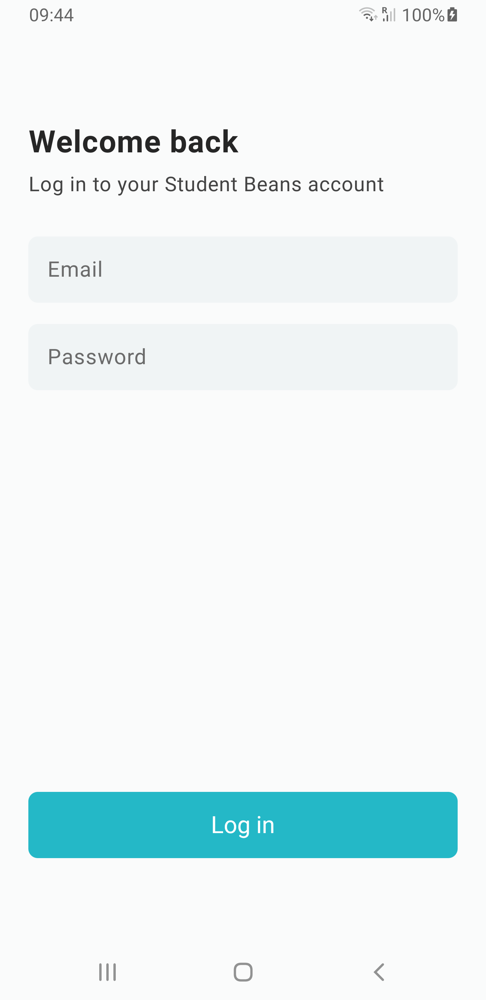
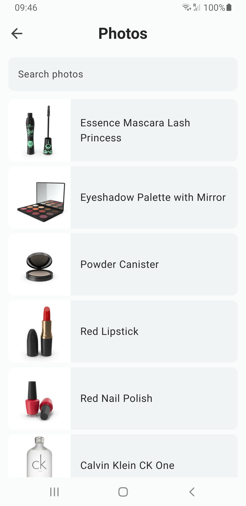
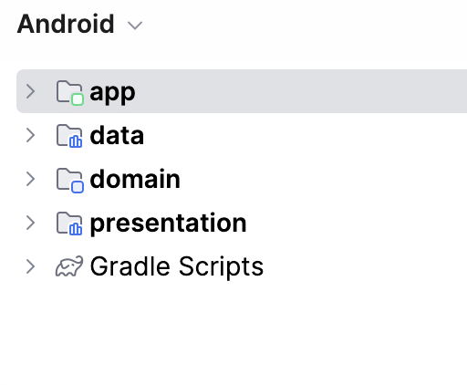

# Pion Android Technical Test

This project is a simple Android application built for the Pion / Student Beans Android technical exercise. It contains a login screen with validation and a photos/products screen powered by the DummyJSON API.

The solution focuses on Jetpack Compose, MVVM, Clean Architecture, clear module separation, testability, and modern Android development practices. The completed implementation is available on the `develop` branch.

## Features

- Login screen built entirely with Jetpack Compose.
- Email and password validation with inline, user-friendly errors.
- Navigation from Login to Photos after successful validation.
- Product loading from the DummyJSON API.
- Product thumbnail and title display using Coil and `LazyColumn`.
- Real-time local title filtering with a 300 ms debounce.
- Loading, retryable error, and empty states.
- Toolbar and system back navigation from Photos to Log in.
- Compose previews for the main Login and Photos UI states.
- User-facing text stored in Android string resources.
- Dark status and navigation bar icons on light backgrounds.
- Responsive, scrollable login layout for compact screens and the software keyboard.

## Screenshots

| Login | Photos |
|---|---|
|  |  |

## Project Structure



## Architecture

The project follows MVVM and Clean Architecture:

```text
Compose UI
    ↓
ViewModel
    ↓
UseCase / Interactor
    ↓
Repository Interface
    ↓
Repository Implementation
    ↓
Retrofit API
```

- Compose observes immutable `StateFlow` state exposed by ViewModels.
- ViewModels coordinate UI state and depend on domain UseCases rather than data implementations.
- UseCases apply business rules through repository abstractions.
- The data layer implements domain repository interfaces.
- Remote DTOs are mapped to domain models before leaving the data layer.
- Retrofit, OkHttp, API contracts, and network configuration remain isolated from presentation and domain code.

## Module Structure

### `:app`

- Application entry point and `MainActivity`.
- Hilt application setup and app-level dependency wiring.
- Navigation Compose host connecting Login and Photos.

### `:presentation`

- Jetpack Compose screens and reusable UI components.
- ViewModels, UI state, and one-off UI events.
- Main-state Compose previews.
- Depends only on `:domain`.

### `:domain`

- Domain models and repository interfaces.
- `GetPhotosUseCase` and `FilterPhotosUseCase`.
- Business rules with no Android or networking framework dependencies.

### `:data`

- Retrofit API, response DTOs, and DTO-to-domain mappers.
- Repository implementations.
- Hilt network and repository modules.
- OkHttp timeouts, debug logging, `BuildConfig.BASE_URL`, and reusable `safeApiCall` handling.

```text
:app          -> :presentation, :domain, :data
:presentation -> :domain
:data         -> :domain
:domain       -> no app module dependencies
```

`:presentation` does not depend on `:data`. The `:domain` module does not depend on Android UI, Retrofit, OkHttp, DTOs, or presentation code.

## Tech Stack

- Kotlin
- Jetpack Compose and Material 3
- Navigation Compose
- AndroidX ViewModel and Lifecycle
- Kotlin Coroutines, Flow, and StateFlow
- Retrofit and OkHttp
- Coil
- Hilt
- Gradle BuildConfig
- JUnit and MockK

## API

The application requests only the product ID, title, and thumbnail:

```text
https://dummyjson.com/products?select=id,title,thumbnail
```

The returned products are displayed as photo rows. Search operates locally against the already loaded titles and does not trigger additional network requests.

## Error Handling

Network calls use a small reusable `safeApiCall` helper. It maps timeout, no-internet, I/O, HTTP, and unexpected failures to user-friendly messages while rethrowing `CancellationException` so coroutine cancellation remains correct. Repositories can provide feature-specific fallback messages, and the Photos UI exposes a Retry action.

## Build Configuration

The DummyJSON base URL is defined in `gradle.properties`, exposed to the data module through `BuildConfig.BASE_URL`, and consumed by `NetworkModule`. No base URL is hardcoded in Kotlin source, and all Retrofit/OkHttp configuration remains in `:data`.

## Testing

The test suite includes:

- Domain tests for photo loading and filtering UseCases.
- Presentation tests for login validation, navigation events, photo states, retry, and debounced search.
- Data repository tests for DTO mapping and common network failure messages.
- Fake repositories and MockK dependencies; tests never call the real network.
- Coroutine virtual time where timing behavior is under test.

Run the full build and test suite:

```bash
./gradlew clean assembleDebug
./gradlew test
```

Useful focused commands:

```bash
./gradlew :domain:test
./gradlew :presentation:testDebugUnitTest
./gradlew :data:testDebugUnitTest
```

## How to Run

1. Clone the repository.
2. Check out the `develop` branch.
3. Open the repository root in Android Studio.
4. Sync Gradle and run the `app` configuration.

```bash
git checkout develop
./gradlew clean assembleDebug
```

## AI Usage Disclosure

I used ChatGPT and Codex as development assistants during this exercise. They were used to help plan the implementation, generate and review unit tests, improve documentation, support refactoring, configure API/network handling, create the Navigation Host structure, and refine the reusable `safeApiCall` API error handling approach. All final implementation decisions, architecture choices, code changes, and submitted work were reviewed and validated by me.

## Notes

The project prioritises clarity, maintainability, and correctness over unnecessary complexity. The implementation is intentionally small and easy to review for the scope of the exercise.
